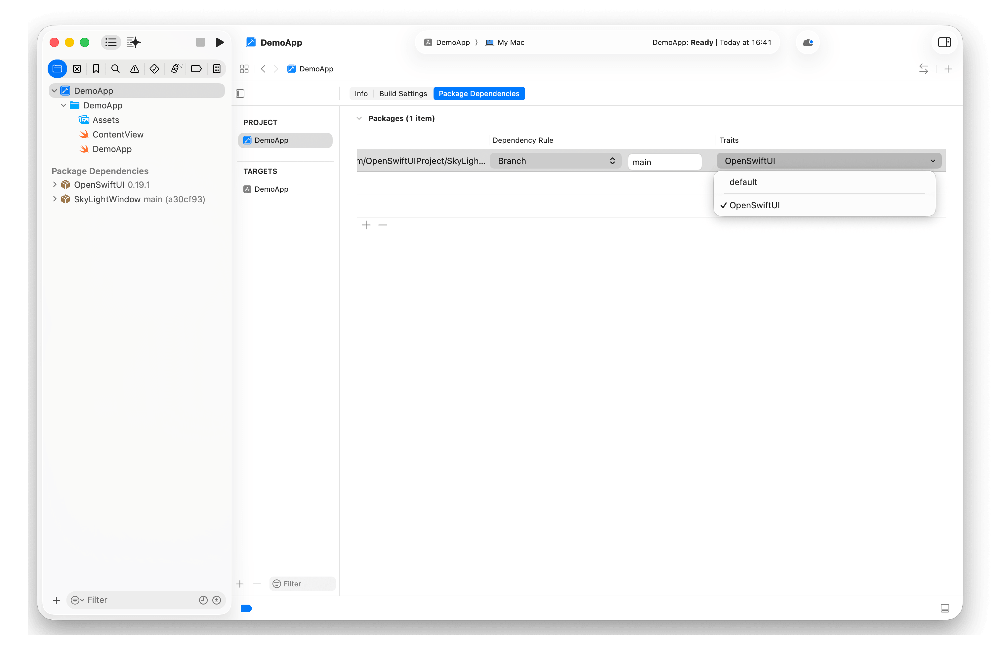

# SwiftUI Library Integration

If you maintain a SwiftUI library and want it to build against either Apple's
SwiftUI or OpenSwiftUI, expose the OpenSwiftUI integration as an opt-in package
trait.

## Declare the Trait

Package traits are available in SwiftPM starting with Swift 6.1 (SE-0450), so
the manifest that declares the trait must use `// swift-tools-version: 6.1` or
newer.

Following the patterns used by
[ScreenShieldKit](https://github.com/Kyle-Ye/ScreenShieldKit/blob/main/Package.swift)
and [SkyLightWindow](https://github.com/Lakr233/SkyLightWindow/blob/main/Package%40swift-6.1.swift),
declare an `OpenSwiftUI` trait and make the OpenSwiftUI product dependency
conditional on that trait:

```swift
// swift-tools-version: 6.1

import PackageDescription

let package = Package(
    name: "YourSwiftUILibrary",
    platforms: [
        // Keep your normal SwiftUI deployment targets here.
        .iOS(.v13),
        .macOS(.v10_15),
        .tvOS(.v13),
        .watchOS(.v6),
        .visionOS(.v1),
    ],
    products: [
        .library(name: "YourSwiftUILibrary", targets: ["YourSwiftUILibrary"]),
    ],
    traits: [
        .trait(
            name: "OpenSwiftUI",
            description: "Enable OpenSwiftUI-backed SwiftUI extensions."
        ),
    ],
    dependencies: [
        .package(
            url: "https://github.com/OpenSwiftUIProject/OpenSwiftUI-spm.git",
            from: "0.19.2"
        ),
    ],
    targets: [
        .target(
            name: "YourSwiftUILibrary",
            dependencies: [
                .product(
                    name: "OpenSwiftUI",
                    package: "OpenSwiftUI-spm",
                    condition: .when(traits: ["OpenSwiftUI"])
                ),
            ]
        ),
    ]
)
```

The trait name is part of your public package configuration. SwiftPM also makes
an enabled trait available as a source-level compilation condition, so source
files can check `#if OpenSwiftUI` directly.

### Preserve Older Swift Toolchain Support

If the default SwiftUI integration must continue supporting toolchains older
than Swift 6.1, keep the existing tools version in `Package.swift` and add a
version-specific manifest for the trait-aware configuration:

```text
Package.swift             # Existing SwiftUI package manifest
Package@swift-6.1.swift   # Adds the OpenSwiftUI trait and dependency
```

Swift 6.1 and newer select `Package@swift-6.1.swift`; older toolchains continue
using `Package.swift`. Keep the package name, products, targets, and default
deployment targets aligned between both manifests. The version-specific
manifest can also use `swiftLanguageModes: [.v5]` when the library should keep
compiling its sources in Swift 5 language mode. Only consumers using Swift 6.1
or newer can enable the `OpenSwiftUI` trait.

## Dependency Selection (Advanced)

The `OpenSwiftUI` trait and `#if OpenSwiftUI` condition above define the library
integration. How a package supplies the OpenSwiftUI product is package-specific.
The binary package is the simplest default; source and local checkouts are
optional development conveniences described in OpenSwiftUI's
[integration guide](https://github.com/OpenSwiftUIProject/OpenSwiftUI/blob/main/INTEGRATION.md).

The following is one possible convention, not a required implementation:

```swift
// MARK: - OpenSwiftUI integration
// See https://github.com/OpenSwiftUIProject/OpenSwiftUI/blob/main/INTEGRATION.md

let openSwiftUISourcePath = Context.environment["OPENSWIFTUI_SOURCE_PATH"].flatMap {
    $0.isEmpty ? nil : $0
}
let openSwiftUIBinary = Context.environment["OPENSWIFTUI_BINARY"].flatMap {
    $0 == "1"
} ?? true

let openSwiftUIDependency: Package.Dependency
let openSwiftUIPackageName: String

if let openSwiftUISourcePath {
    openSwiftUIDependency = .package(path: openSwiftUISourcePath)
    openSwiftUIPackageName = "OpenSwiftUI"
} else if openSwiftUIBinary {
    openSwiftUIDependency = .package(
        url: "https://github.com/OpenSwiftUIProject/OpenSwiftUI-spm.git",
        from: "0.19.2"
    )
    openSwiftUIPackageName = "OpenSwiftUI-spm"
} else {
    openSwiftUIDependency = .package(
        url: "https://github.com/OpenSwiftUIProject/OpenSwiftUI.git",
        branch: "main"
    )
    openSwiftUIPackageName = "OpenSwiftUI"
}
```

Use `openSwiftUIDependency` in `Package.dependencies` and
`openSwiftUIPackageName` as the product dependency's `package:` value. This
example defaults to binary, while a non-empty source path takes priority:

```bash
swift build --traits OpenSwiftUI
OPENSWIFTUI_BINARY=0 swift build --traits OpenSwiftUI
OPENSWIFTUI_SOURCE_PATH=/path/to/OpenSwiftUI swift build --traits OpenSwiftUI
```

Packages may instead remain binary-only, pin a source revision, use a separate
development manifest, or provide another override. Source integrations must
also account for the selected OpenSwiftUI revision's toolchain and platform
requirements.

## Enable the Trait

### Package.swift

Consumers enable the trait on the library package dependency:

```swift
dependencies: [
    .package(
        url: "https://github.com/YourOrg/YourSwiftUILibrary.git",
        from: "1.0.0",
        traits: ["OpenSwiftUI"]
    ),
]
```

If your package also declares default traits and the consumer wants those
defaults plus OpenSwiftUI, they should include `.defaults` explicitly:

```swift
traits: [.defaults, "OpenSwiftUI"]
```

When developing the library itself, enable the trait from the command line with:

```bash
swift build --traits OpenSwiftUI
```

### Xcode Project

Xcode 26.4 and newer can enable package traits directly in an Xcode project:

1. Add the SwiftUI library through **File > Add Package Dependencies**.
2. Select the blue project icon in the Project navigator, then select the
   project under **PROJECT**.
3. Open the project's **Package Dependencies** tab.
4. Choose **OpenSwiftUI** in the package's **Traits** column.



Code in an OpenSwiftUI app should import `OpenSwiftUI` instead of `SwiftUI`.
Selecting the package trait configures the dependency package only. If the app
target also uses `#if OpenSwiftUI` to switch its own imports or implementation,
add `OpenSwiftUI` to **Swift Active Compilation Conditions** for every relevant
app build configuration while preserving `$(inherited)`. An app that imports
`OpenSwiftUI` unconditionally does not need this additional compilation
condition.

## Select the UI Framework in Source

In your source, import only the framework that matches the selected build path.
Use this form when the API exists only for OpenSwiftUI builds:

```swift
#if OpenSwiftUI
import OpenSwiftUI

extension View {
    // OpenSwiftUI-only extensions.
}
#endif
```

Use this form when the same public API should be available in both SwiftUI and
OpenSwiftUI builds:

```swift
#if OpenSwiftUI
import OpenSwiftUI
#else
import SwiftUI
#endif

extension View {
    // Shared API implemented against the selected framework.
}
```

When `traits:` is specified on a dependency, SwiftPM uses exactly that trait set
for the dependency. Add `.defaults` when you want to keep a package's default
traits. Also keep the trait additive from the user's point of view: enabling
`OpenSwiftUI` should add or redirect the implementation without unexpectedly
removing public API.

## Platform Compatibility

OpenSwiftUI's binary frameworks currently support iOS 18.0+ on devices and
simulators, and macOS 15.0+. Source integration requirements come from the
selected OpenSwiftUI revision. Your library may keep broader SwiftUI support for
its default build, but the `OpenSwiftUI` trait must only be enabled with a
compatible dependency, toolchain, and platform configuration.
